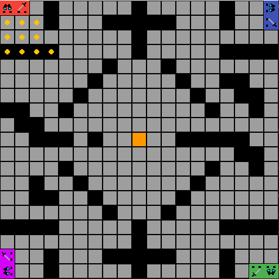
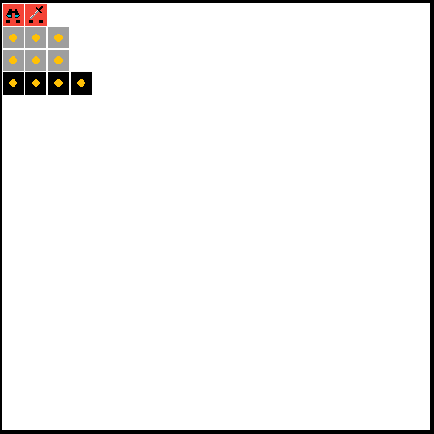
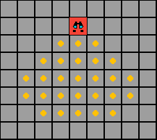
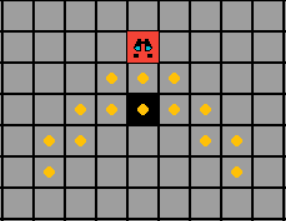
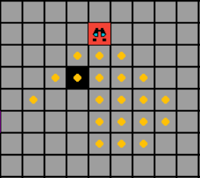
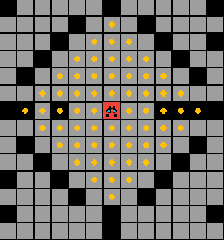
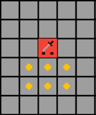
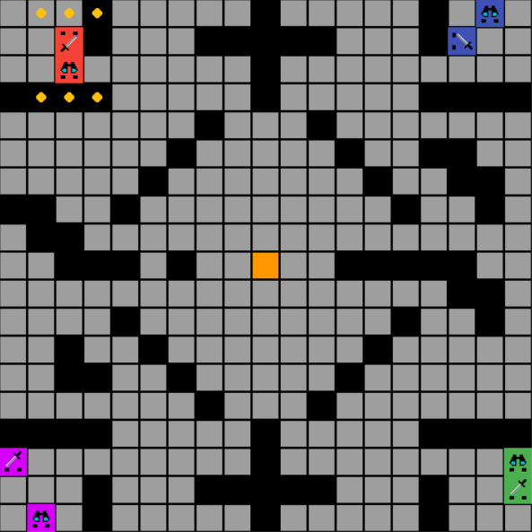

# The Monkey and The Metal Man

## Introduction

Behold! A game of mind boggling strategy and incomplete information. To win you must best every other player and **be the last man standing**. 

In this game, you will control 2 pieces: 
- The Monkey - A spotter with a huge line of sight but slow movement.
- The Metal Man - An assasin who can move quickly but is very short sighted.

You start with no knowledge of the map and as time progresses, you build a model of the map using the information you collect.

Every turn, you get to see only what your pieces - the Assasin and the Spotter - can see, so postion them wisely!

What a person with complete information sees:



What you see:



## The "Game"

### Goal
The goal of the game is to have the last surviving piece(s) on the board.

### The Map
- The entire map is made of 3 different types of terrain:
  - Walls
  - Empty tiles
  - Highground tiles
- The bots start with no knowledge of the environment
- The coordinate system of the map has been indicated below


### Line of Sight

The line of sight of the Assasin or the Spotter can be obstructed by a wall, hence limiting its vision. 

Every point behind an obstruction is hidden and is not visible.

For example:

- Unobstructed vision from spotter:


- Obstacle directly in front of spotter:


- Obstacle blocking from the side:
  


### Highground

When a spotter is on a highground tile, his line of sight changes. His line of sight cannot be blocked by any walls (imagine standing at the top of a mountain and being able to see without being blocked in all directions) The spotter can also see in all directions.



### The Spotter

The Spotter is a slow moving piece which has a huge line of sight.

It can move upto 2 tiles in a given turn. For example, the sequence of moves could be [UP, LEFT], [DOWN, UP], etc.

**NOTE: UP = [-1,0], DOWN = [1,0], RIGHT = [0,1], LEFT = [0,-1]**

Below is the line of sight of an spotter.


### The Assasin

The Assasin is a fast moving, short sighted piece.

It can move upto 4 tiles in a given turn. For example, the sequence of moves could be [UP, UP, LEFT, LEFT], [DOWN, RIGHT, RIGHT, UP], etc.

**NOTE: UP = [-1,0], DOWN = [1,0], RIGHT = [0,1], LEFT = [0,-1]**

Below is the line of sight of an assasin.



### Movement

- **The moves of the Spotter are always carried out first**
- **You cannot move into a wall** - If you have a wall to your right and you try to move right, a move is consumed but your position will not change.
- **You cannot move into your other piece** - If you have your other piece to your right and you try to move right, a move is consumed but your position is not updated.
- **Moving into an enemy** - There are two scenarios in which this can happen:
  - Intermediate step on the location of an enemy piece - nothing happens, a normal move is carried out (you "jump" over the enemy piece).
  - Your final location is the same as the location of an enemy - you capture the enemy piece, eliminating it.

### Turn Mechanics

Assume there are 4 players in this game (player 0,1,2,3). Player 0 moves first, then 1, then 2, and finally 3. This completes 1 round of play.

In each turn, you are provided with percepts (what you can see) and you  must provide an action as a response.

### Collapsing Map

To prevent camping in the corner of the map, we slowly start shrinking the size of the map by collapsing the outer most circle of the map after every 5 rounds.

Any pieces in this circle when the map collapses are eliminated.

Example:

Before map collapses:



After map collapses:


## Percepts

The way percepts are provided to the bot is in the form of a python dictionary.

The structure is as follows:
```python
percepts = {
    "board": board,
    "timer": timer,
    "circles collapsed": circles,
    "spotter location": spotter_point,
    "assasin location": assasin_point,
    "spotter alive": spotter_alive,
    "assasin alive": assasin_alive,
    "spotter direction": spotter_direction,
    "assasin direction": assasin_direction
}
```
board - please refer to the next section for a detailed view of the board.

(int) timer - number of rounds until the next circle of the map collapses

(int) circles collapsed - number of map circles that have collapsed already

(bool) assasin alive - boolean indicating whether your assasin piece is alive

(bool) spotter alive - boolean indicating whether your spotter piece is alive

(tuple) assasin location - the position of the assasin (x,y)

(tuple) spotter location - the position of the spotter (x,y)

(list) spotter direction - the direction of the spotter [1,0] or [-1,0] or [0,1] or [0,-1]

(list) assasin direction - the direction of the assasin [1,0] or [-1,0] or [0,1] or [0,-1]

### board percept

a 2D array (nested list) with each element being:
- an integer (indicating normal terrain):
  - -1: points that are not visible to your player currently
  - 0: walls
  - 1: empty tiles
  - 2: highground tiles
- a dicitonary (indicating an enemy piece) with fields:

```python

{
    "playerId":other_agent_id,
    "direction":other_assasin_direction,
    "type":"assasin",
    "square":board[other_assasin_point[0]][other_assasin_point[1]]
}

```

(int) playerID - the ID of the enemy piece in your LOS

(list) direction - the direction the enemy piece is facing

(str) type - either "assasin" or "spotter"

(int) square - the terrain on which the enemy piece is standing

## Actions

In the bot's step function, you must accept an argument for state and must return an action.

The action must be a python diction with structure as follows:

```python

{
"Spotter":{
    "direction":spotter_direction, # or [-1,0],[0,1],[0,-1]
    "moves":spotter_moves # max length 2, 
    # if you input more than 2, truncated to first 2
    # if you dont input any, no move made
    # input [1,0] makes the bot move from (x,y) to (x+1,y)
    # other inputs include [-1,0],[0,1],[0,-1]
    # if you hit a wall/ edge of the map, that move is ignored and one of your 2 moves is used up
    # landing on an opponent kills them
},
"Assasin":{
    "direction":assasin_direction, # or [-1,0],[0,1],[0,-1]
    "moves":assasin_moves # max length 4, 
    # if you input more than 4, truncated to first 4
    # if you dont input any, no move made
    # input [1,0] makes the bot move from (x,y) to (x+1,y)
    # other inputs include [-1,0],[0,1],[0,-1]
    # if you hit a wall/ edge of the map, that move is ignored and one of your 4 moves is used up
    # landing on an opponent kills them
}
}
```
The building blocks of the moves must be one of the following 4:
**UP = [-1,0], DOWN = [1,0], RIGHT = [0,1], LEFT = [0,-1]**

The moves must be lists of the above values.

Example: 

```python
assasin_move = [[-1,0],[-1,0],[-1,0]]
```

The direction must be one of the 4 above values.

Example: 

```python
assasin_direction = [0,1]
```